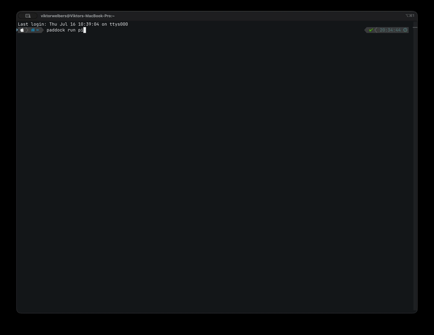

# Paddock

[](https://github.com/ViktorWelbers/paddock/actions/workflows/ci.yaml)
[](LICENSE)

**A self-hosted governance plane for coding agents.**

Paddock spawns per-user sandboxes for agents like Claude Code and OpenCode on *your own* Kubernetes cluster, and puts a gateway between the agent and the outside world. Every model call is metered against a budget. Every tool and MCP call passes a policy check. Everything is written to an audit log your compliance team can hand to a regulator.

Paddock is **not** a meta-harness or an agent framework. It doesn't orchestrate agents, compose them, or replace your agent of choice. It answers one question for the enterprise: *"Our developers want to run autonomous coding agents — how do we let them without losing control of cost, credentials, and compliance?"*

 

## Why

Coding agents are being adopted faster than platform teams can govern them. Today the typical setup is: an API key in an engineer's shell profile, unbounded spend, tools with unrestricted network and credential access, and no audit trail. That is a non-starter for banks, insurers, and anyone under DORA or the EU AI Act.

Paddock gives the platform team a single control point:

- **Budgets** — hierarchical (org → team → user → session) spend ledgers with soft warnings and hard stops. The agent's model traffic is proxied, token usage is priced, and the ledger is debited in real time.
- **Sandboxes** — each session runs in a locked-down pod: egress allowed only to the Paddock gateway, no secrets mounted, no service-account token, CPU and memory capped. Real provider API keys never enter the sandbox. Sessions are pods in paddock's own namespace, so the server installs with a namespaced Role — no cluster-scoped RBAC.
- **Your code, not a blank page** — `paddock run` uploads your working directory into the sandbox and `paddock pull` brings the agent's edits back. In a git repo, `.gitignore` decides what travels. Files move through the server, so the CLI needs no cluster access.
- **Governed egress** — agents can install dependencies, from the registries you allow and nowhere else. Traffic goes through a CONNECT proxy on the gateway that tunnels TLS end-to-end (paddock never sees your source or your packages) and decides on the domain. Every attempt is audited, allowed or denied, with byte counts.
- **Server-side MCP** — MCP servers are centrally administered by the platform team, run outside the sandbox, and have their credentials injected at the gateway. Developers get capabilities, not secrets.
- **Policies** — OPA/Rego decisions on every tool call, MCP call, and egress connection. Your platform team already speaks Rego; reuse the pipelines and review process you have for Gatekeeper.
- **Audit** — append-only event log of sessions, model calls, tool calls, egress, workspace transfers, and policy decisions, designed to back DORA / EU AI Act evidence requirements.

## Architecture (30 seconds)

```
 developer                    control plane                    data plane
 ─────────                    ─────────────                    ──────────
 paddock run claude ───────▶  paddock-server ──── spawns ───▶  sandbox pod
   (uploads your cwd)         │  sessions              (Claude Code; the only
                              │  budgets                route out is the gateway)
                              │  audit log                     │
                              │  workspace ──── tar ──────────▶│ /workspace
                              │                                │
                              │        policy (OPA) ◀──────────┤ ANTHROPIC_BASE_URL
                              │        budget check ◀──────────┤ HTTPS_PROXY
                              ▼                                ▼
                          SQLite/Postgres              paddock-gateway
                                                       │ token metering
                                                       │ MCP mux + credential broker
                                                       │ egress proxy (allowlist)
                                                       ▼
                                     model APIs / MCP servers / package registries
```

## Quickstart (k3d, ~5 minutes)

Requires docker, [k3d](https://k3d.io), kubectl, helm, Go.

```sh
export ANTHROPIC_API_KEY=sk-ant-...   # optional; omit to run with a fake key
make dev-up                           # k3d cluster + images + helm install
make e2e                              # end-to-end smoke test (works without a real key)
make e2e-egress                       # dependency installs allowed, exfiltration refused

make build
cd ~/your-project
paddock run claude                    # uploads this directory, attaches to Claude Code
paddock pull <id>                     # bring the agent's edits back
paddock budget                        # see spend
paddock events <id>                   # what it called, fetched, and was denied
paddock rm <id>                       # tear the sandbox down
```

Developers on a team with a running deployment don't need the repo at all:

```sh
go install github.com/viktorwelbers/paddock/cmd/paddock@latest
paddock config set server https://paddock.internal   # your deployment's URL, once
paddock run claude
```

The CLI finds the server once and remembers it: platform teams expose the
server behind an ingress (e.g. `https://paddock.internal`) and developers save
it with `paddock config set server https://paddock.internal`. `PADDOCK_SERVER`
overrides the saved value per shell (CI, one-offs), and with neither set the
CLI falls back to `localhost:8080`, where the k3d dev loop maps the cluster
ingress. That's the whole story: no port-forwards, no kubeconfig magic. Inside
the sandbox, the agent's only route out is the Paddock gateway: no cluster API,
no real keys, and no internet beyond the domains you allow.

## Your workspace in the sandbox

`paddock run` uploads the current directory before attaching, because an agent
with no code can't do anything useful. In a git repo the upload set is git's
own answer — tracked and untracked-but-not-ignored files, plus `.git` so the
agent has real history — which means `.gitignore` already decides what travels
and `node_modules` stays home. Outside a repo, the directory goes up as-is.

```sh
paddock run claude              # uploads the current directory, then attaches
paddock run claude --no-push    # start with an empty /workspace
paddock push <id> [dir]         # upload again (--clean to mirror exactly)
paddock pull <id> [dir]         # bring the agent's edits back
```

`pull` overwrites what the archive contains and leaves everything else alone,
like a git checkout. Files travel through the server over `pods/exec`, so the
CLI needs no kubeconfig and no exec rights of its own, and both directions are
audited (`workspace.push` / `workspace.pull`, with byte counts and a sha256).

## Governed egress: dependencies without a blank cheque

An agent that can't run `pip install` is a toy; an agent with open internet is
an exfiltration channel. Paddock's answer is the one [nono](https://github.com/always-further/nono)
uses: the sandbox has no route to the internet at all, and the gateway offers a
single governed door.

The gateway runs an HTTP **CONNECT proxy** that sandboxes reach via injected
`HTTP_PROXY`/`HTTPS_PROXY` (authenticated with the session token). It **tunnels**
rather than intercepts, so TLS stays end-to-end — paddock decides on the
*domain* and never sees your source code or the packages you fetch. There are no
CAs to install and no certificates to trust.

Every connection is authenticated, matched against the allowlist, evaluated by
OPA, and re-checked **after DNS resolution**, so a rebound hostname can't reach
the metadata service, the kube API, or another namespace. Allowed, denied, and
closed (with bytes) all land in the audit trail:

```
$ paddock events <id>
egress.allowed  {"host":"pypi.org","groups":["package_registries"]}
egress.closed   {"host":"pypi.org","bytes_sent":3945,"bytes_received":313909}
egress.denied   {"host":"gitlab.com","reason":"not_in_allowlist"}
```

**Default-deny**: with no allowlist configured the proxy runs and refuses
everything (still audited). Operators opt domains in by group:

```yaml
gateway:
  egress:
    enabled: true
    allowedPorts: [443]        # CONNECT targets; 443 only by default
    plainHTTP: false           # no cleartext proxying
    allowedPrivateCIDRs: []    # keep RFC1918/CGNAT/link-local blocked
    allowlist:
      groups:
        package_registries:
          - pypi.org
          - files.pythonhosted.org
          - registry.npmjs.org
          - proxy.golang.org
          - sum.golang.org
        github:
          - github.com
          - "*.github.com"     # sub-domains only, never the apex
          - codeload.github.com
```

Group names are what the audit trail and your policies see. A pattern is an
exact host or a `*.example.com` wildcard matching sub-domains only. IP-literal
targets are always refused — they'd defeat the rebinding check. (`make dev-up`
seeds pypi and github so the dev loop is useful out of the box; a plain
`helm install` starts closed.)

The static allowlist is the first half of the decision; `policies/egress.rego`
is the second, and it can use the groups:

```rego
package paddock.authz

import rego.v1

# Ships by default: nothing reaches a host that no group claims.
deny contains msg if {
	input.kind == "egress"
	count(input.groups) == 0
	msg := sprintf("host %q matches no allowed egress group", [input.host])
}

# Yours to add: allowlist the group globally, restrict it per team.
deny contains msg if {
	input.kind == "egress"
	"github" in input.groups
	not input.user in {"platform-team"}
	msg := "cloning from github is restricted to the platform team"
}
```

Egress input is `{kind: "egress", user, agent, session, host, port, groups}`.
Policies fail closed: if the engine errors the connection is denied and audited
as `policy_error`. Because the decision is per-connection and carries the user,
"who may reach what" is a Rego question, not a redeploy.

Test your rules the way you already test Gatekeeper policies — `make policy-test`
runs `opa test` over `policies/` (no need to install opa; the Makefile runs the
pinned version through `go run`). Worth doing: a Rego rule that references a
field the input doesn't carry is simply *undefined*, so it never fires, denies
nothing, and reads perfectly well in review. `policies/egress_test.rego` has
that exact case as a regression test.

### Any agent, any model server

Paddock is agent-neutral. The gateway also fronts OpenAI-compatible upstreams
(vLLM, llama.cpp, ...), with the same session-token auth, usage metering
(streaming included — the gateway forces `stream_options.include_usage`, so
clients can't opt out of metering), budgets, and audit trail. The
[pi coding agent](https://github.com/badlogic/pi-mono) is wired in as the second
supported agent:

```sh
# point the gateway at your OpenAI-compatible model server
make k3d-deploy OPENAI_UPSTREAM=https://your-vllm.example OPENAI_MODEL=your/model
make e2e-pi                           # governed completion, metering, netpol — end to end
./bin/paddock run pi                  # interactive pi session in a sandbox
```

### Custom agent images

The default agent images ship node, git, python3 (use `python3 -m venv .venv`
— system site-packages are locked down), make, jq, and ripgrep. For other
toolchains, extend the image and point paddock at it — everything else stays
the same:

```dockerfile
FROM <your-registry>/paddock/agent-claude:latest
USER root
RUN apt-get update && apt-get install -y --no-install-recommends golang && rm -rf /var/lib/apt/lists/*
USER 10001:10001
# keep the inherited tini entrypoint — it holds the sandbox pod
```

Wire it up via the `agentImage` helm value (or per-agent with the server's
`--agent-images claude=myreg/agent-go:v1` flag).

## Dashboard

The server ships a read-only dashboard at its root URL (`/`): budgets with
spend meters, sessions, and each session's audit trail. It's a single embedded
HTML file — no extra deployment, no JS toolchain, works wherever the API is
reachable.

## Deploying to your own cluster

There are no published container images yet — build them from source and push
to a registry your cluster can pull from:

```sh
# 1. Build and push the images
make push REGISTRY=<your-registry> TAG=$(git rev-parse --short HEAD)

# 2. The real provider key lives in one Secret, gateway-side only
kubectl create namespace paddock
kubectl -n paddock create secret generic paddock-anthropic \
  --from-literal=ANTHROPIC_API_KEY=sk-ant-...

# 3. Install
helm upgrade --install paddock deploy/helm/paddock -n paddock \
  --set image.repository=<your-registry>/paddock/paddock \
  --set image.tag=<tag> \
  --set agentImage=<your-registry>/paddock/agent-claude:<tag>
```

See `deploy/helm/paddock/values.yaml` for the full surface: ingress (put the
server behind one; developers save the URL with `paddock config set server`),
persistent SQLite,
an OpenAI-compatible upstream for pi (`gateway.openai.*`, including a
`caConfigMap` for private CAs), and the server-side MCP registry. An ArgoCD
`Application` example lives in [`deploy/argocd/`](deploy/argocd). If your
registry uses a self-signed CA, trust it in Docker before pushing.

## Open core

Everything in this repository is Apache 2.0 and always will be: the gateway, sandbox runner, budgets, OPA integration, and audit log. A commercial self-hosted tier adds what enterprises buy in procurement: SSO/SAML, chargeback exports, DORA / EU AI Act report packs, SIEM export, tamper-evident signed audit logs, and a curated feed of vetted MCP servers.

## Status

Alpha / skeleton. See [docs/ROADMAP.md](docs/ROADMAP.md). Design partners from regulated industries: get in touch.
