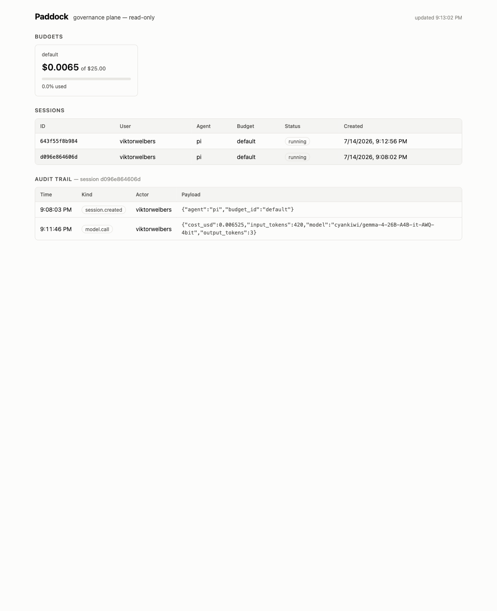

# Paddock

[](https://github.com/ViktorWelbers/paddock/actions/workflows/ci.yaml)
[](LICENSE)

**A self-hosted governance plane for coding agents.**

Paddock spawns per-user sandboxes for agents like Claude Code and OpenCode on *your own* Kubernetes cluster, and puts a gateway between the agent and the outside world. Every model call is metered against a budget. Every tool and MCP call passes a policy check. Everything is written to an audit log your compliance team can hand to a regulator.

Paddock is **not** a meta-harness or an agent framework. It doesn't orchestrate agents, compose them, or replace your agent of choice. It answers one question for the enterprise: *"Our developers want to run autonomous coding agents — how do we let them without losing control of cost, credentials, and compliance?"*

## Why

Coding agents are being adopted faster than platform teams can govern them. Today the typical setup is: an API key in an engineer's shell profile, unbounded spend, tools with unrestricted network and credential access, and no audit trail. That is a non-starter for banks, insurers, and anyone under DORA or the EU AI Act.

Paddock gives the platform team a single control point:

- **Budgets** — hierarchical (org → team → user → session) spend ledgers with soft warnings and hard stops. The agent's model traffic is proxied, token usage is priced, and the ledger is debited in real time.
- **Sandboxes** — each session runs in a locked-down pod: egress allowed only to the Paddock gateway, no secrets mounted, no service-account token, CPU and memory capped. Real provider API keys never enter the sandbox. Sessions are pods in paddock's own namespace, so the server installs with a namespaced Role — no cluster-scoped RBAC.
- **Server-side MCP** — MCP servers are centrally administered by the platform team, run outside the sandbox, and have their credentials injected at the gateway. Developers get capabilities, not secrets.
- **Policies** — OPA/Rego decisions on every tool and MCP call. Your platform team already speaks Rego; reuse the pipelines and review process you have for Gatekeeper.
- **Audit** — append-only event log of sessions, model calls, tool calls, and policy decisions, designed to back DORA / EU AI Act evidence requirements.

## Architecture (30 seconds)

```
 developer                    control plane                    data plane
 ─────────                    ─────────────                    ──────────
 paddock run claude ───────▶  paddock-server ──── spawns ───▶  sandbox pod
                              │  sessions              (Claude Code, egress
                              │  budgets                only to gateway)
                              │  audit log                     │
                              │                                │ ANTHROPIC_BASE_URL
                              │        policy (OPA) ◀──────────┤
                              │        budget check ◀──────────┤
                              ▼                                ▼
                          SQLite/Postgres              paddock-gateway
                                                       │ token metering
                                                       │ MCP mux + credential broker
                                                       ▼
                                              model APIs / MCP servers
```

## Quickstart (k3d, ~5 minutes)

Requires docker, [k3d](https://k3d.io), kubectl, helm, Go.

```sh
export ANTHROPIC_API_KEY=sk-ant-...   # optional; omit to run with a fake key
make dev-up                           # k3d cluster + images + helm install
make e2e                              # end-to-end smoke test (works without a real key)

make build
./bin/paddock run claude              # spawn a governed session and attach to Claude Code
./bin/paddock budget                  # see spend
./bin/paddock rm <id>                 # tear the sandbox down
```

Developers on a team with a running deployment don't need the repo at all:

```sh
go install github.com/viktorwelbers/paddock/cmd/paddock@latest
paddock config set server https://paddock.internal   # your deployment's URL, once
paddock run claude
```

The CLI finds the server once and remembers it: platform teams expose the
server behind an ingress (e.g. `https://paddock.internal`) and developers save
it with `paddock config set server https://paddock.internal`. `PADDOCK_SERVER`
overrides the saved value per shell (CI, one-offs), and with neither set the
CLI falls back to `localhost:8080`, where the k3d dev loop maps the cluster
ingress. That's the whole story: no port-forwards, no kubeconfig magic. Inside the sandbox, Claude Code can only reach the Paddock
gateway: no internet, no cluster API, no real keys.

### Any agent, any model server

Paddock is agent-neutral. The gateway also fronts OpenAI-compatible upstreams
(vLLM, llama.cpp, ...), with the same session-token auth, usage metering
(streaming included — the gateway forces `stream_options.include_usage`, so
clients can't opt out of metering), budgets, and audit trail. The
[pi coding agent](https://github.com/badlogic/pi-mono) is wired in as the second
supported agent:

```sh
# point the gateway at your OpenAI-compatible model server
make k3d-deploy OPENAI_UPSTREAM=https://your-vllm.example OPENAI_MODEL=your/model
make e2e-pi                           # governed completion, metering, netpol — end to end
./bin/paddock run pi                  # interactive pi session in a sandbox
```

### Custom agent images

The default agent images ship node, git, python3 (use `python3 -m venv .venv`
— system site-packages are locked down), make, jq, and ripgrep. For other
toolchains, extend the image and point paddock at it — everything else stays
the same:

```dockerfile
FROM <your-registry>/paddock/agent-claude:latest
USER root
RUN apt-get update && apt-get install -y --no-install-recommends golang && rm -rf /var/lib/apt/lists/*
USER 10001:10001
# keep the inherited tini entrypoint — it holds the sandbox pod
```

Wire it up via the `agentImage` helm value (or per-agent with the server's
`--agent-images claude=myreg/agent-go:v1` flag).

## Dashboard

The server ships a read-only dashboard at its root URL (`/`): budgets with
spend meters, sessions, and each session's audit trail. It's a single embedded
HTML file — no extra deployment, no JS toolchain, works wherever the API is
reachable.



## Deploying to your own cluster

There are no published container images yet — build them from source and push
to a registry your cluster can pull from:

```sh
# 1. Build and push the images
make push REGISTRY=<your-registry> TAG=$(git rev-parse --short HEAD)

# 2. The real provider key lives in one Secret, gateway-side only
kubectl create namespace paddock
kubectl -n paddock create secret generic paddock-anthropic \
  --from-literal=ANTHROPIC_API_KEY=sk-ant-...

# 3. Install
helm upgrade --install paddock deploy/helm/paddock -n paddock \
  --set image.repository=<your-registry>/paddock/paddock \
  --set image.tag=<tag> \
  --set agentImage=<your-registry>/paddock/agent-claude:<tag>
```

See `deploy/helm/paddock/values.yaml` for the full surface: ingress (put the
server behind one; developers save the URL with `paddock config set server`),
persistent SQLite,
an OpenAI-compatible upstream for pi (`gateway.openai.*`, including a
`caConfigMap` for private CAs), and the server-side MCP registry. An ArgoCD
`Application` example lives in [`deploy/argocd/`](deploy/argocd). If your
registry uses a self-signed CA, trust it in Docker before pushing.

## Open core

Everything in this repository is Apache 2.0 and always will be: the gateway, sandbox runner, budgets, OPA integration, and audit log. A commercial self-hosted tier adds what enterprises buy in procurement: SSO/SAML, chargeback exports, DORA / EU AI Act report packs, SIEM export, tamper-evident signed audit logs, and a curated feed of vetted MCP servers.

## Status

Alpha / skeleton. See [docs/ROADMAP.md](docs/ROADMAP.md). Design partners from regulated industries: get in touch.
